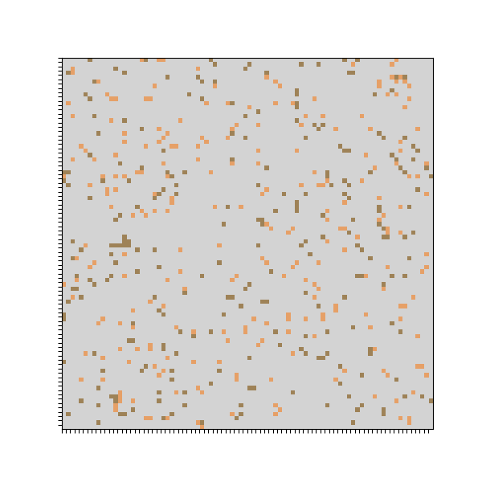
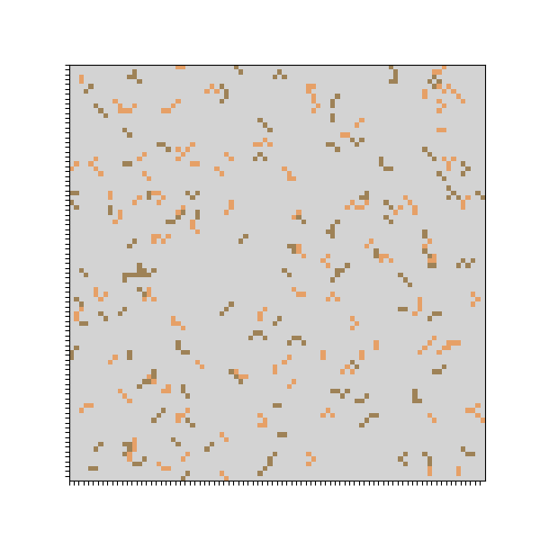

A more in-depth explanation is available here: "[notebooks/Tutorial.ipynb](notebooks/Tutorial.ipynb)".

The Schelling Segregation Model is a simple agent-based simulation that shows that small preferences for similarity cause self-organization into clusters.

The model was introduced in the early 1970s by the American economist Thomas Schelling. The most notable publication where Schelling discussed the model is his 1971 paper titled "Dynamic Models of Segregation," published in the Journal of Mathematical Sociology.

Basically, in this model agents are allowed to move about a Cartesian coordinate plane randomly, until they settle on a cell which has a suitable number of neighbors. 

This codebase implements a simple version of this model.  The model is instantiated with agents in random positions: 

...and an equilibrium is found through iteration: 

...[here](https://youtu.be/d4dFCsp6cfA) is a YouTube video which displays the process of finding equilibrium. 

For more information, please view "[notebooks/Tutorial.ipynb](notebooks/Tutorial.ipynb)". 
